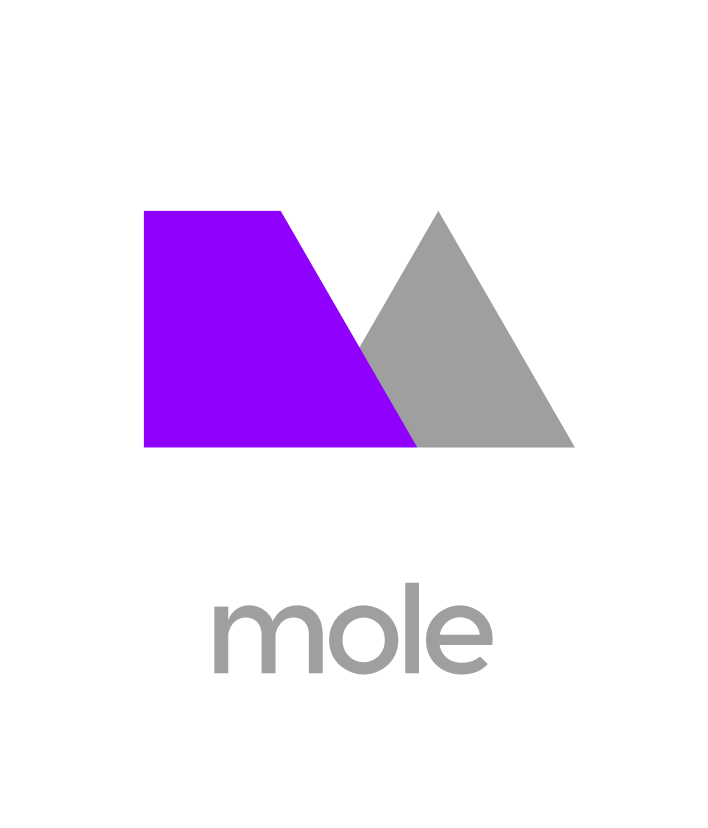

<p align="center"></p>

<p align="center">
    <a href="https://www.npmjs.com/package/mole"></a>
    <a href="https://travis-ci.org/limitlessloop/mole"></a>
    <a href="https://discord.gg/BDEvF8m"></a>    
</p>

<!-- [![NPM Version][npm-img]][npm-url]
[![Build Status][cli-img]][cli-url]
[![Discord][discord-img]][discord-url] -->

<hr />

Mole is a platform agnostic preprocessor that allows you to create your own design system framework.

It's main features are:

-   Bare bones library to create your own framework
-   Multiple use cases from creating design tokens, to CSS frameworks, to something else entirely
-   Simple, flexible, automatic template choosing, optional named outputs

> Mole is currently in alpha and it's features are still evolving. If you'd like to contribute to it's progress please see the [contributing guidelines](./CONTRIBUTING.md) for how you can help.

## Install

Setup your project and install `mole` as a dependency. Use `@next` for the next alpha release.

```bash
npm install mole@next --save-dev
```

Build output files using

```js
mole.build()
```

Configure `mole` using one of the methods below.

See the [examples](https://github.com/limitlessloop/mole/tree/master/examples) for different ways of configuring your project.

## Configure

By default `mole` will look for a file called `mole.config.js` at the root of your project, you can override this using `mole.config()`.

_An example of a config file_

```js
// mole.config.js
module.exports = {
    theme: 'theme.js', // The path of your theme file (supports .js and .jsonnet) 
    model: ['model-name'], // The name or path of any models you want to use (optional)
    template: ['template-name'], // The name or path of any templates you want to use
    output: [ // You can have one or more outputs
        { css: { file: 'styles.css' } }, 
        { ios: { file: 'styles.h' } },
        { android: { file: 'styles.xml' } }
    ]
}
```

_An example of manually setting the location of the config file_

```js
mole.config('src/mole.config.js')
```

### Config Options

| Property   | Type                               | Description                                                                                                                                                                                                                                                                                                                                                                                                                                                                                                                                                                                                         |
| ---------- | ---------------------------------- | ------------------------------------------------------------------------------------------------------------------------------------------------------------------------------------------------------------------------------------------------------------------------------------------------------------------------------------------------------------------------------------------------------------------------------------------------------------------------------------------------------------------------------------------------------------------------------------------------------------------- |
| `theme`    | <nobr>`{String}` (Optional)</nobr> | The location of your theme data. Mole supports `js`, and `jsonnet`.                                                                                                                                                                                                                                                                                                                                                                                                                                                                                                                                                 |
| `model`    | <nobr>`{String}` (Optional)</nobr> | Can be either a `named model`, a `dir` or a path to a __js__ `file` which exports a callback. When a `dir` is used it will look for files or sub directories who's name matches a named output. An array can be used to specify multiple models.                                                                                                                                                                                                                                                                                                                                                                    |
| `template` | <nobr>`{String}`</nobr>            | Can be either a `named template`, a `dir`, or a path to a __js__ `file` which exports a function or template string, or a __njk__ `file` which contains [Nunjucks](https://mozilla.github.io/nunjucks/) template code. When a `dir` is used it will look for sub directories who's name matches a named output and then look for file names matching a top level key inside `data`. Failing this it will look for files who's name matches a named output inside the directory. Additionally you may wish to name a file `index` and that will be used instead. An array can be used to specify multiple templates. |
| `output`   | <nobr>`{Object}`</nobr>            | An object with properties specifying where and how to process the output. You can specify a different `template` or `model` for each output. Create a named output by surrounding it in a key. An array can be used to specify multiple outputs.                                                                                                                                                                                                                                                                                                                                                                    |


## Theme

A theme is a file used to describe different design decisions, characteristics, traits or tokens. Mole is fairly unopinionated about how you use it so you can structure your theme data how you like. In fact a theme is completely optional if you prefer.

_Below is a trivial example of a theme_

```js
{
    font: {
        size: [
            16,
            19,
            22,
            26,
            30,
            35
        ]
    }
}
```

Theme data is accessible inside `models` and is immutable from inside them. When you create a `model` this returns an object which updates the main model and is then available to use by `templates` when they are rendered.

To avoid logic responsible for describing certain design characteristics being stored in models, you can can describe theme data using a more expressive method using [Jsonnet]() which includes functions from it's [standard library]().

_Example using Jsonnet_

```js
{
    font: {
        size: [
            std.ceil(16 * std.pow($.number['golden ratio'], n))
            for n in std.range(0, 5)
        ]
    }
}
```

## Models

Models allow you to create a data structure from theme data so it can be used by different templates for different platforms and languages.

When more than one model is assigned to an output the data from each model is merged together.

_To create a named model_

```js
mole.create('model', 'model-name', (theme) => {

    // Create a data model by modifying the theme data
    model = theme.red
    
    return model
})
```

## Templates

Templates allow you to format data for a specific platform or language. You can create templates by either using template strings (using [Nunjucks](https://mozilla.github.io/nunjucks/)) or a function.

When multiple templates are specified the strings from each template are merged into one.

_To create a template using a function_

```js
mole.create('template', 'template-name', (theme, model) => {

    let utility = model.font.size
    let string = ''

    for (let i = 0; i < utility.length; i++) {
        let value = utility[i]
		string += `.$font-${i} {\n`
		string += ` font-size: ${value}\n`
		string += `}\n`
    }
    
    return string
})
```

_To create a template using a template string_

```js
mole.create('template', 'template-name',

    `.font-{{modifier}} {
        font-size: {{value}};
    }`
})
```
## API

| Property        | Type                         | Description                            |
| --------------- | ---------------------------- | -------------------------------------- |
| `mole.config()` | `{String}` or `{Object}`     | Set the configuration                  |
| `mole.theme()`  | `{String}` or `{Object}`     | Set or update the theme data           |
| `mole.create()` | `{Type}, {Name}, {Callback}` | Create a model or template             |
| `mole.render()` |                              | Returns an array of rendered templates |
| `mole.build()`  |                              | Build the output files                 |


## Development

To install

```bash
npm install mole@next --save-dev
```

To run/compile

```bash
npm run build
```

To test

```
npm run test
```

To test and watch for changes

```
npm run dev
```
